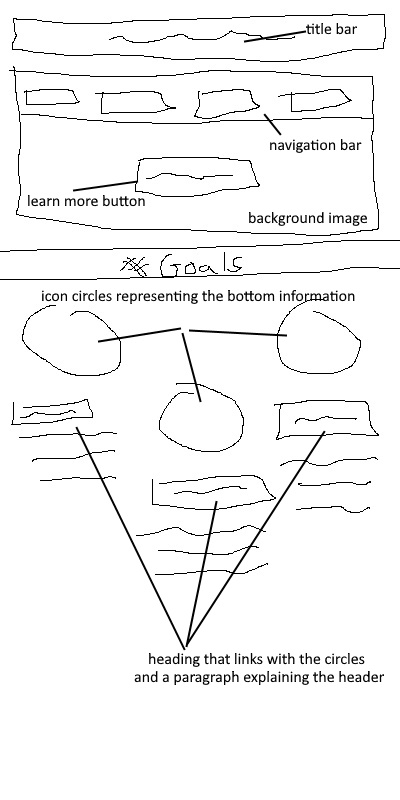
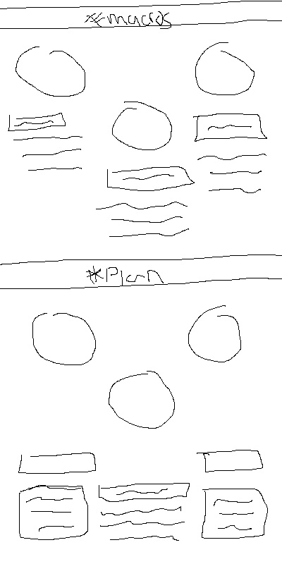
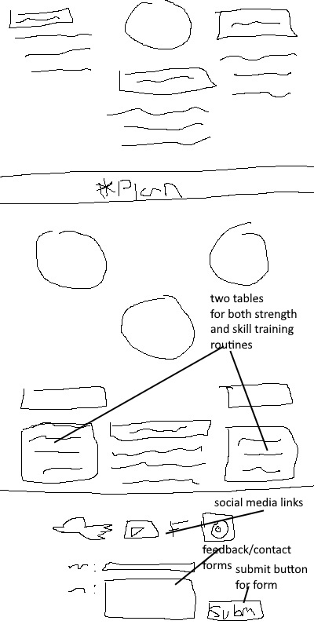
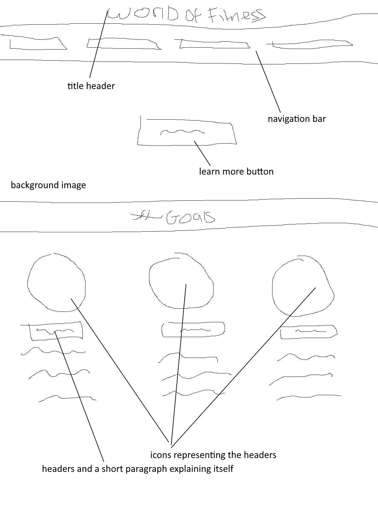
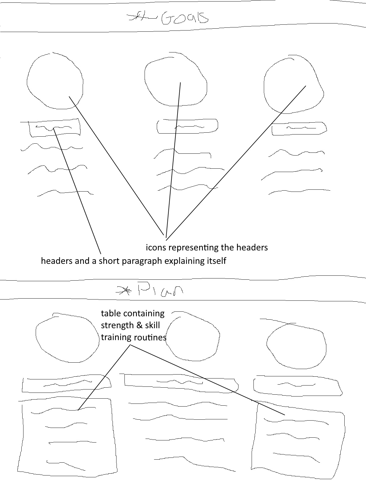
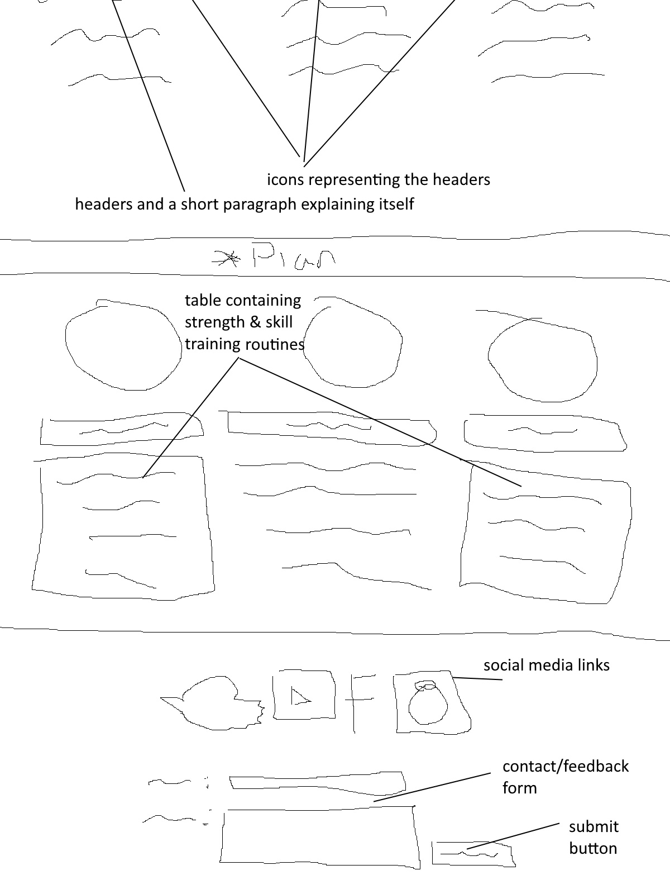

<h1 align="center">World of Fitness</h1>

[View the live project here.](https://diomdede.github.io/milestone_website_one/)

This is the main website for World of Fitness, a website designed to help people get in shape through a short written program

<h2 align="center"></h2>

## User Experience (UX)

-   ### User stories

    -   #### First Time Visitor Goals

        1. As a First Time Visitor, I want to understand the program & how I can apply it into my lifestyle.
        2. As a First Time Visitor, I want to be able to easily navigate throughout the site to find content.
        3. As a First Time Visitor, I want to look for testimonials to understand what their users think of them and see if they are trusted. I also want to locate their social media links to see their followings on social media to determine how trusted and known they are.

    -   #### Returning Visitor Goals

        1. As a Returning Visitor, I want to double check the workout plan or maybe copy and paste it to a sticky note or notepad document for easier use.
        2. As a Returning Visitor, I want to find the best way to get in contact with the creators of the program for feedback or help with the program.
        3. As a Returning Visitor, I want to find community links.

    -   #### Frequent User Goals
        1. As a Frequent User, I want to check to see if there are any changes to the program or information sections.
        2. As a Frequent User, I want to check if there is any additions to the excerise section as it is the main program that you follow.
        3. As a Frequent User, I want to send feedback or ask questions regarding the program & their progress, they would use the contact form in the footer.

-   ### Design
    -   #### Colour Scheme
        -   The two main colors used in the website is a teal green, dark navy blue & white.
    -   #### Typography
        -   The Oswald font is the main font used throughout the whole website with Sans Serif as the fallback font in case for any reason the font isn't being imported into the site correctly. Oswald is a tight & modern easy to read font that fits with the theme of the website and complements the color scheme. Paytone One is also used for some headers & titles as it is a bold & dominant font.
    -   #### Imagery
        -   The main banner image is a man lifting weights to represent fitness & excerise, it also complements the color scheme with a deep red tone.

*   ### Wireframes

    - [Mobile]
        1. Page One
        
        2. Page Two
        
        3. Page Three
        

    - [Desktop]
        1. Page One
        
        2. Page Two
        
        3. Page Three
        


## Features

-   Responsive on all device sizes

-   Interactive elements

## Technologies Used

### Languages Used

-   [HTML5](https://en.wikipedia.org/wiki/HTML5)
-   [CSS3](https://en.wikipedia.org/wiki/Cascading_Style_Sheets)

### Frameworks, Libraries & Programs Used

1. [Google Fonts:](https://fonts.google.com/)
    - Google fonts were used to import the 'Titillium Web' font into the style.css file which is used on all pages throughout the project.
   [Font Awesome:](https://fontawesome.com/)
    - Font Awesome was used many times to apply icons onto my website.
1. [Git](https://git-scm.com/)
    - Git was used for version control by utilizing the Gitpod terminal to commit to Git and Push to GitHub.
1. [GitHub:](https://github.com/)
    - GitHub is used to store the projects code after being pushed from Git.
1. [Paint.net:](https://www.getpaint.net/download.html)
    - Paint.net was used to create the [wireframes](https://github.com/) during the design process.
   [cssgradient](https://cssgradient.io/)
    - cssgradient was used to create easy to use gradients that I can use for my header design.

## Testing

The W3C Markup Validator and W3C CSS Validator Services were used to validate every page of the project to ensure there were no syntax errors in the project.

-   [W3C Markup Validator](https://jigsaw.w3.org/css-validator/#validate_by_input) - [Results](https://github.com/)
-   [W3C CSS Validator](https://jigsaw.w3.org/css-validator/#validate_by_input) - [Results](https://github.com/)

### Testing User Stories from User Experience (UX) Section

-   #### First Time Visitor Goals

    1. As a First Time Visitor, I want to easily understand the program and what it entails

        1. Upon entering the site the users are greeted with a motto and a quick description of what the program aims to do.
        2. The main points are made immediately with the motto and simple points such as Want to learn more?
        3. The user has two options, click the navigation bars which are labeled correctly, or scroll down and click 'Learn More' which takes them to the start of the program.

    2. As a First Time Visitor, I want to be able to easily be able to navigate throughout the site to find content.

        1. The site has been designed to be easy on the eyes with a clear nice color scheme.
        2. The navigation bar is simple and has icons that corresponds the section it takes them too, further making it easier to find what they need.
        3. On the Contact Us Page, after a form response is submitted, the page refreshes and the user is brought to the top of the page where the navigation bar is.
        4. The site is one html page that navigates through taking the user to sections instead of new pages which lowers their waiting time to get them where they need.

    3. As a First Time Visitor, I would want to check their popularity and see if the program is working for others before trying it.
        1. I could check their socials through the footer which is presistant across the site
        2. It links to creators Facebook, Twitter, Youtube, Instagram
        3. I could check others results of the program through these communities and find out more information on the program through socials

    4. As a First Time Visitor, I would want to check the details on what the program achieves
        1. I could easily check this as there is a navigation button labeled 'Goals'
        2. The navigation is at the header of the screen so it will be easy to locate
        3. The goals section explains what the program will help you achieve

-   #### Returning Visitor Goals

    1. As a Returning Visitor, I would want to check if there is any

        1. These are clearly shown in the banner message.
        2. They will be directed to a page with another hero image and call to action.

    2. As a Returning Visitor, I want to find the best way to get in contact with the program creators with any questions I may have.
        1. The footer clearly highlights the "Contact Us" Page.
        2. Here they can fill out the form on the page or are told that they can also get in touch on socials.
        3. The footer contains links to the creators Facebook, Twitter and Instagram page.
        4. Whichever link they click, it will be open up in a new tab to ensure the user can easily get back to the website.
        5. The contact form is easily set up so you just input your email and message then click submit.

    3. As a Returning Visitor, I may want to find our facebook community and get in contact with other members following the program
        1. The footer clearly highlights the facebook page via link.
        2. It opens a new tab directly to the facebook page so they can follow with ease

-   #### Frequent User Goals

    1. As a Frequent User, I want to check if there is any updates to the workout plan or information

        1. The user would already know where to look for the plan and would click the excerise button on the navigational link

    2. As a Frequent User, I may want to request some help with my workout plan or general questions

        1. The user would scroll to the bottom with a persistant footer
        2. The user would easily find the 'contact us' page as it is hinted at the bottom of the page
        3. The form is easy to recognize and find

    3. As a Frequest User, I may want to go back and find out or refresh my memory on information
        1. The user could easily find information due to categories and formatted layout(s).

### Further Testing

-   The Website was tested on Google Chrome, Opera, Microsoft Edge.
-   The website was viewed on a variety of devices using responinator, such as iPhone 6-8, iPad, Desktop.
-   Large amounts of testing was done to ensure the navigation buttons links to the corresponding sections
-   Friends and family members were asked to review the site and documentation to point out any bugs and/or user experience issues.

### Known Bugs

-   There is no known bugs

## Deployment

### GitHub Pages

The project was deployed to GitHub Pages using the following steps...

1. Log in to GitHub and locate the [GitHub Repository](https://github.com/)
2. At the top of the Repository (not top of page), locate the "Settings" Button on the menu.
    - Alternatively Click [Here](https://raw.githubusercontent.com/) for a GIF demonstrating the process starting from Step 2.
3. Scroll down the Settings page until you locate the "GitHub Pages" Section.
4. Under "Source", click the dropdown called "None" and select "Master Branch".
5. The page will automatically refresh.
6. Scroll back down through the page to locate the now published site [link](https://github.com) in the "GitHub Pages" section.

### Forking the GitHub Repository

By forking the GitHub Repository we make a copy of the original repository on our GitHub account to view and/or make changes without affecting the original repository by using the following steps...

1. Log in to GitHub and locate the [GitHub Repository](https://github.com/)
2. At the top of the Repository (not top of page) just above the "Settings" Button on the menu, locate the "Fork" Button.
3. You should now have a copy of the original repository in your GitHub account.

### Making a Local Clone

1. Log in to GitHub and locate the [GitHub Repository](https://github.com/)
2. Under the repository name, click "Clone or download".
3. To clone the repository using HTTPS, under "Clone with HTTPS", copy the link.
4. Open Git Bash
5. Change the current working directory to the location where you want the cloned directory to be made.
6. Type `git clone`, and then paste the URL you copied in Step 3.

```
$ git clone https://github.com/YOUR-USERNAME/YOUR-REPOSITORY
```

7. Press Enter. Your local clone will be created.

```
$ git clone https://github.com/YOUR-USERNAME/YOUR-REPOSITORY
> Cloning into `CI-Clone`...
> remote: Counting objects: 10, done.
> remote: Compressing objects: 100% (8/8), done.
> remove: Total 10 (delta 1), reused 10 (delta 1)
> Unpacking objects: 100% (10/10), done.
```

Click [Here](https://help.github.com/en/github/creating-cloning-and-archiving-repositories/cloning-a-repository#cloning-a-repository-to-github-desktop) to retrieve pictures for some of the buttons and more detailed explanations of the above process.

## Credits

- [https://tdeecalculator.net/] was used as a method of gaining the users daily calories

### Code

- All code was written by the developer.

### Content

-   All content was written by the developer.

### Media

-   [https://www.glogym.co.uk/wp-content/uploads/2016/01/red-gym-banner.jpg] was used for the main banner image.

### Acknowledgements

-   My Mentor for continuous helpful feedback.

-   Tutor support at Code Institute for their support.

